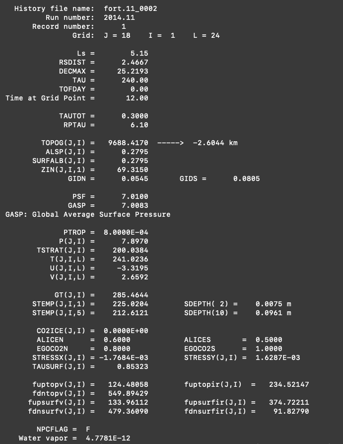

# NASA Ames Legacy Mars Global Climate Model README

Official Public Release

This software has reached end of life and will not receive further updates aside from critical bug fixes.

***

# Installing, Compiling, and Running The Legacy GCM

## Introduction

Welcome to the Mars Climate Modeling Center (MCMC) Legacy Mars Global Climate Model (GCM) installation tutorial. By the end of this tutorial, you will know how to configure, compile, and run the GCM, and how to check the initial model results for accuracy. The analysis pipeline tutorial will build on what you learn here by expanding on model analysis capabilities.

The GCM presented here is extensively documented in [Haberle et al. 2019 (_Documentation of the NASA/Ames Legacy Mars Global Climate Model: Simulations of the present seasonal water cycle_)](https://www.sciencedirect.com/science/article/pii/S0019103518305761).

## Requirements

This tutorial has been tested on Mac, Linux, and Windows 10. The commands below are assumed to be utilized in the terminal on Mac and Linux machines, and in either the native terminal or Cygwin on Windows machines (depending on the version of the Windows). If you need Cygwin for a Windows machine, you can find instructions for download and installation [here](https://cygwin.com).

### FORTRAN Compiler

A FORTRAN compiler is required to compile the GCM. We recommend the Intel or GNU compiler. While the Intel (ifort) FORTRAN compiler requires purchasing a license, the GNU (gfortran) FORTRAN compiler is freely available. Information on the Intel compiler can be found here: https://www.intel.com. The GNU compiler can be installed with a package manager such as [Homebrew](https://brew.sh), [MacPorts](http://macports.org) or [Cygwin](https://cygwin.com), or directly from the [source code](https://gcc.gnu.org/wiki/GFortran). Once you have installed the compiler, make sure you have the path to it included in your bash or csh profile.

***

## Installing and Compiling the GCM

The first steps are to install and compile the GCM on your machine.

### Installation: Clone the repository

```bash
% git clone https://github.com/nasa/legacy-mars-global-climate-model.git
```

This will produce a directory called `legacy-mars-global-climate-model`. Navigate into that directory and list its contents:

```bash
% cd legacy-mars-global-climate-model
% ls -l
```

The following directories will be visible:

```bash
./documentation          # contains GCM documentation
./code                   # contains the GCM source code
./run                    # is where you will run the model
./run/data               # contains the required input files for the GCM
./analysis               # contains a simple analysis routine for checking a simulation
./analysis/validation    # contains sample plots from the default settings
./tutorial               # contains files used in this tutorial
```

> **A Note on Directory Configuration**
>
> While not necessary, it may be useful to place the different directories described above in different locations on your computer. The source code and data files are relatively small and can be placed anywhere. The GCM history files can take up large amounts of disk space (a typical 2 year run uses \~20 gigabytes) so you may want to place the `run`/ directory in a scratch directory or somewhere similar. Note that any changes you make to the default directory structure need to be taken into account in the instructions below, so if you are unsure about how to do this, it is probably best to start with the default structure.

### Compilation: Makefile & Compiler Compatibility

From the main model directory (`legacy-mars-global-climate-model/`), navigate to the source code (`code/`) directory:

```bash
% cd code
```

The Makefile is set up to use the GNU Fortran (gfortran) compiler by default. Settings for the Intel (ifort) compiler are also available. You will need to modify the Makefile to use ifort. To do this, open the Makefile and comment the gfortran options and uncomment the ifort options. The original lines are:

```fortran
#F90_COMP  = ifort
#F_OPTS    = -c -O2
F90_COMP = gfortran
F_OPTS   = -c -O3 -finit-local-zero -frecord-marker=4
```

and the lines modified for ifort will instead be:

```fortran
F90_COMP = ifort
F_OPTS   = -c -O2
#F90_COMP  = gfortran
#F_OPTS    = -c -O3 -finit-local-zero -frecord-marker=4
```

Once the Makefile is ready, you can proceed with compiling the model. First, remove all object files (`*.o`), and module files (`*.mod`) to ensure a clean build by typing:

```bash
% make clean
```

Next, compile the code by typing:

```bash
% make
```

which creates an executable file called `gcm2.3`. Note that warnings that are not fatal may appear during the compile. If the executable is written, the compilation was successful. If fatal errors are produced during the compile and the compile fails, no executable will be created. In this case, check that the compiler can be found on the command line (i.e., set the `$PATH` correctly) and that the Makefile is set up properly for your compiler.

***

## Running the Model

Before running the model, you will need to move (or copy) the executable file (`gcm2.3`) to the `run/` directory as well as the tutorial namelist file (`tutorial/mars_tutorial`). Navigate into that directory, and list its contents (note that this command assumes you're using the default directory structure):

```bash
% cp gcm2.3 ../tutorial/mars_tutorial ../run/
% cd ../run/
% ls
```

You will see the following in this directory, which are all the necessary components for running the model:

```bash
gcm2.3           # the executable
mars_tutorial    # the input file that includes runtime options
```

The `mars_tutorial` file has the default set-up for your initial test simulation. The parameters and options in the `mars_tutorial` file are described in more detail below, but for now, no editing of this file is needed.

To run the model, type:

```bash
% ./gcm2.3 mars_tutorial m.out &
```

In this command, `m.out` is the name of the output log file that will be produced, and the `&` will make the model run in the background.

If the model is running correctly, you will see fort.11, fort.51, and fort.91 files being created in the current directory (`run/`). The initial default simulation will simulate 20 sols (Martian days) and take approximately an hour to complete.

***

# Analyzing GCM Output

## Checking the Default Simulation

To check that the simulation ran properly, we will run a simple analysis routine called `htest.f90`. Navigate to the `tutorial/` directory:

```bash
% cd ../tutorial/
```

To compile `htest.f90` using gfortran, type:

```bash
% gfortran -c historymod.f90
% gfortran -o htest htest.f90 historymod.o
```

To compile using ifort, type:

```bash
% ifort -c historymod.f90
% ifort -o htest htest.f90 historymod.o
```

Next, copy the `htest` executable (`htest.exe` in Windows) and `htest.in` input file to the `run/` directory and navigate to it:

```bash
% cp htest htest.in ../run/   #  cp htest.exe htest.in ../run/ in Windows
% cd ../run/
```

`htest` is a routine that prints out information from one location (in latitude, longitude, and vertical coordinate) at one time step of the simulation. To print out information from latitude index number 18 (the equator), longitude index 1 (-180 East), and vertical coordinate index 24 (first atmospheric layer above the ground) at the first output from the 20th martian day of simulation, type:

```bash
% ./htest < htest.in
```

The output from `htest` will be:



You should reproduce the information above quite closely. There may be variations in the fourth or fifth decimal place due to hardware and compiler differences but they should be small. If you reproduce these `htest` results, you have successfully installed and run the GCM.

***

## Notices:

Copyright © 2021 United States Government as represented by the Administrator of the National Aeronautics and Space Administration.  All Rights Reserved.

## Disclaimers

No Warranty: THE SUBJECT SOFTWARE IS PROVIDED "AS IS" WITHOUT ANY WARRANTY OF ANY KIND, EITHER EXPRESSED, IMPLIED, OR STATUTORY, INCLUDING, BUT NOT LIMITED TO, ANY WARRANTY THAT THE SUBJECT SOFTWARE WILL CONFORM TO SPECIFICATIONS, ANY IMPLIED WARRANTIES OF MERCHANTABILITY, FITNESS FOR A PARTICULAR PURPOSE, OR FREEDOM FROM INFRINGEMENT, ANY WARRANTY THAT THE SUBJECT SOFTWARE WILL BE ERROR FREE, OR ANY WARRANTY THAT DOCUMENTATION, IF PROVIDED, WILL CONFORM TO THE SUBJECT SOFTWARE. THIS AGREEMENT DOES NOT, IN ANY MANNER, CONSTITUTE AN ENDORSEMENT BY GOVERNMENT AGENCY OR ANY PRIOR RECIPIENT OF ANY RESULTS, RESULTING DESIGNS, HARDWARE, SOFTWARE PRODUCTS OR ANY OTHER APPLICATIONS RESULTING FROM USE OF THE SUBJECT SOFTWARE.  FURTHER, GOVERNMENT AGENCY DISCLAIMS ALL WARRANTIES AND LIABILITIES REGARDING THIRD-PARTY SOFTWARE, IF PRESENT IN THE ORIGINAL SOFTWARE, AND DISTRIBUTES IT "AS IS."

Waiver and Indemnity:  RECIPIENT AGREES TO WAIVE ANY AND ALL CLAIMS AGAINST THE UNITED STATES GOVERNMENT, ITS CONTRACTORS AND SUBCONTRACTORS, AS WELL AS ANY PRIOR RECIPIENT.  IF RECIPIENT'S USE OF THE SUBJECT SOFTWARE RESULTS IN ANY LIABILITIES, DEMANDS, DAMAGES, EXPENSES OR LOSSES ARISING FROM SUCH USE, INCLUDING ANY DAMAGES FROM PRODUCTS BASED ON, OR RESULTING FROM, RECIPIENT'S USE OF THE SUBJECT SOFTWARE, RECIPIENT SHALL INDEMNIFY AND HOLD HARMLESS THE UNITED STATES GOVERNMENT, ITS CONTRACTORS AND SUBCONTRACTORS, AS WELL AS ANY PRIOR RECIPIENT, TO THE EXTENT PERMITTED BY LAW.  RECIPIENT'S SOLE REMEDY FOR ANY SUCH MATTER SHALL BE THE IMMEDIATE, UNILATERAL TERMINATION OF THIS AGREEMENT.
